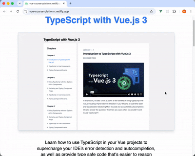

# Course Platform

A full-stack course platform built with Nuxt. Visitors can access the first three lessons for free; full access requires a paid subscription. Authentication is handled via GitHub OAuth.

**Stack:**

- **Nuxt** (Vue 3) — SSR with server-side API routes
- **TypeScript** — end-to-end type safety
- **Supabase** — PostgreSQL database and GitHub OAuth authentication
- **Prisma** — database ORM and migrations
- **Stripe** — subscription payments and webhooks
- **Tailwind CSS** — utility-first styling

**Live:** [vue-course-platform.netlify.app](https://vue-course-platform.netlify.app/)

For testing payment use stripe test card: 4242424242424242 and any future date.

**Preview:**



## Environment setup

Copy `.env sample` to `.env` and fill in the values:

```bash
cp ".env sample" .env
```

The `.env` file is gitignored. Docker Compose loads it automatically via `env_file`; for local development, Nuxt reads it on startup.

## Docker development

Recommended for local development. No local Node.js installation required.

### Prerequisites

- [Docker Desktop](https://www.docker.com/products/docker-desktop/) installed and running

### First run

```bash
docker compose watch
```

On the first run, this builds the image, starts the container, and enables file watching. The app is available at `http://localhost:3000`.

### Daily workflow

```bash
docker compose watch   # start dev server with hot reload on http://localhost:3000
docker compose down    # stop and remove the container
```

### How file watching works

- Changes in `app/`, `server/`, `shared/`, `public/`, and `prisma/` are synced instantly (no rebuild)
- Changes in `package.json` or `nuxt.config.ts` trigger an automatic image rebuild
- Changes in `Dockerfile.dev` require a manual rebuild (see below)

Use `docker compose watch` (or `docker compose up --watch`). Plain `docker compose up` does not sync file changes.

### Prisma schema changes

When you update `prisma/schema.prisma`, the file syncs automatically, but you must run migrations manually:

```bash
docker compose exec app npx prisma migrate dev
docker compose exec app npx prisma generate
```

### Force rebuild (after Dockerfile.dev changes)

```bash
docker compose up --build --watch
```

## Local development

Alternative to Docker. Requires Node.js — see [`.nvmrc`](.nvmrc) for the version (22.14.0).

```bash
nvm use
npm install
npm run dev
```

The app is available at `http://localhost:3000`.

### Prisma schema changes

```bash
npx prisma migrate dev
npx prisma generate
```

## Production

Production is deployed on Netlify. For local production-like testing:

```bash
npm run build
npm run preview
```
